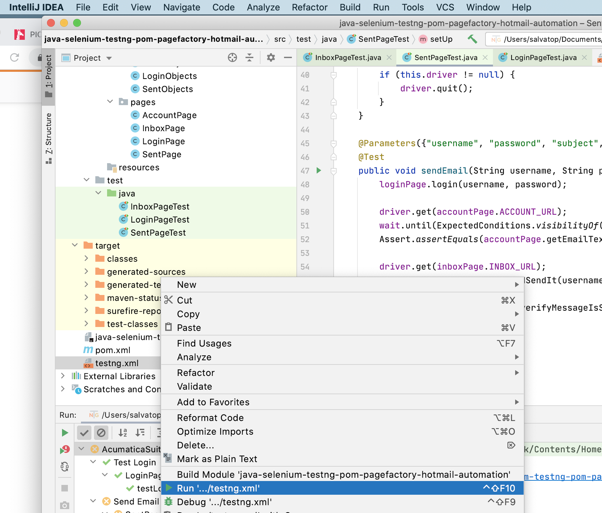

# java-selenium-testng-pom-pagefactory-hotmail-automation

The program support the following browsers: Mozilla FireFox, Google Chrome;

It make use of the page object model and the page factory design patterns, and it has different abstraction layers for Browser/WebElements/PageObjects/Tests:

  - Browser layer – implements interactions with different browsers through common interface (e.g. a class that contains a WebDriver object and provides an API for interacting with this object);
  - WebElements layer – implements classes with logic for different elements on pages (e.g. textbox/link/button) by using the Browser layer;
  - PageObjects layer – implements classes which describe different web pages (e.g.login page/mail page) with WebElements objects in them;
  - Tests layer – implements different classes with actual tests that interact with the browser through the PageObjects/WebElements layer;

All configuration data (e.g. web driver parameters, mail service web-interface address,user credentials, etc.) are stored in the testng.xml configuration file;

The program allow to run tests separately by modifying the configuration file;

All exceptions (e.g. invalid mail service web-interface address, invalid password or username, etc.) are handled to prevent abnormal program termination;

The program can be executed through the command-line interface with the configuration file passed as an argument;
  - mvn clean test -Dsurefire.suiteXmlFiles=testng.xml


**Logging**
When logging is enabled it will generate a text file with the same name of the test class in the root directory of the progect.
To disable logging change the value to **false** of: ```<parameter name = "isFileLoggerEnabled" value="true"/>``` in the *testng.xml*.

**Browser**
To to use different browsers just change the value of: ```<parameter name = "browser" value="chrome"/>``` to **firefox** or **chrome**. 

**Enable/Disable Tests**
To include or exlude a test from the test suite just change the value ton include/exlude accordingly.
```
<test name = "Send Email" parallel="false" preserve-order="true">
        <classes>
            <class name = "SentPageTest">
                <methods>
                    <exclude name="sendEmail"/>
                </methods>
            </class>
        </classes>
    </test>
```

**Known Issues**
The actual configuration allow to run a single test when run from command line, to workaround the problem it's possible to tun directly the tesngn.xml from any modern IDE like in the picture below



**Improvment Needed**
- Implement groups to have a better control of the test suite to run
- Improve logging and logging output 
